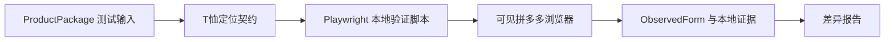
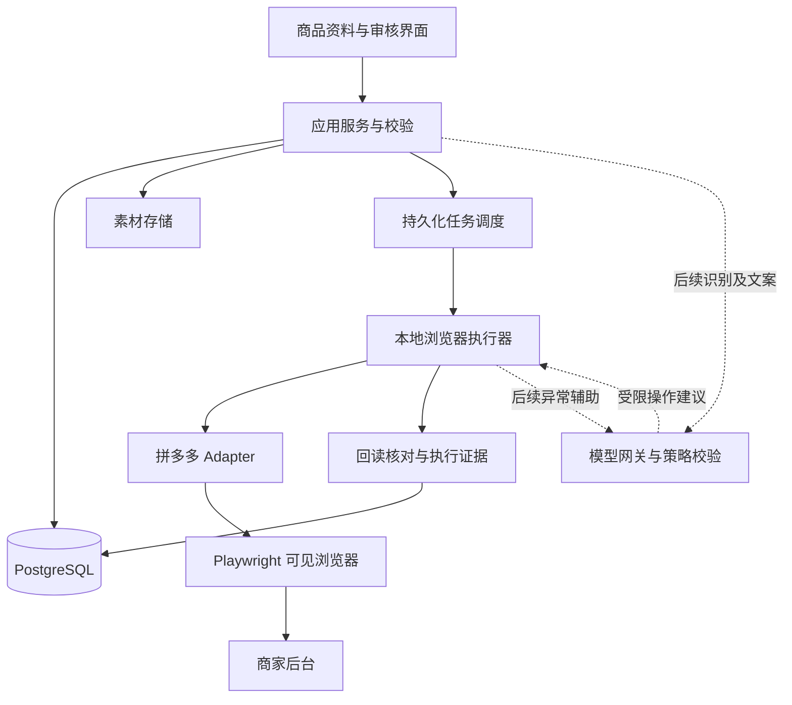

# 系统架构与技术决策

## 1. R1～R3 当前验证结构



## 1.1 R5 目标结构



## 2. 首版技术基线

工程分为当前验证栈和草稿闭环通过后的目标栈。当前已有 React/Vite、Node.js、JSON Schema、内存 Mock API 与 Playwright；验证期不迁移到 Next.js，也不以 PostgreSQL 完成为真实 Adapter 的前置条件。

| 层 | 首版选择 | 理由与边界 |
|---|---|---|
| 当前界面 | React / Vite + TypeScript | 继续迭代已有资料卡、模拟任务与审核原型 |
| 当前真实验证 | Node.js 脚本 + Playwright 独立 profile | 先证明 T 恤定位、填写、回读与草稿可靠性 |
| 目标应用 HTTP API | React 应用服务；草稿闭环后决定是否迁移 Next.js | 资料卡、表格、审核与服务共享类型 |
| 目标浏览器执行 | 独立 Node.js / TypeScript worker + Playwright | 长任务独立于 HTTP 请求生命周期 |
| 契约与校验 | JSON Schema + Ajv；业务规则单独实现 | 输入结构与跨字段校验分开 |
| 验证期证据 | 本地受控 JSON、截图与 trace | 单机单任务，明确不作为正式任务数据库 |
| 产品化持久化 | PostgreSQL | 草稿闭环通过后承载任务、商品、版本、日志和锁 |
| 产品化队列 | PostgreSQL jobs 表 + 租约轮询 | R5 单执行器无需先引入 Redis |
| 后续队列 | Redis + BullMQ（需要时） | DB 仍为任务状态来源，消息可重复投递 |
| 素材与证据 | 本地受控目录 + DB 元数据 | 后续可替换对象存储，业务引用 assetId |
| 图片基础处理 | sharp 等确定性处理库，接入前验证 | 保留原图，派生图另建记录 |
| AI | 可替换 provider 接口 | v0.1 正常流程可完全关闭 AI |

不要把浏览器长任务放在 Next.js 请求或无状态 serverless handler 中。HTTP 创建任务后立即返回 jobId。

## 3. 部署与用户会话

### 3.1 模拟与真实验证环境隔离

mock 模式已经建成，真实 T 恤页面也已完成两状态只读采集。当前进入 `pdd-browser` 的定位、写入与草稿验证；执行模式属于任务运行上下文，不写入商品事实。

- mock：本地模拟商家页面与模拟类目/物流规则；Playwright 实际操作模拟页面，覆盖动态属性、SKU 重排、上传、草稿与故障。不能只用直接返回成功的 stub 替代浏览器链路。
- pdd-browser：共享领域、校验、任务、审核逻辑，使用真实拼多多规则与页面组件；DOM 定位、平台字段约束、草稿对账和结果解析在可访问店铺后完成联调。
- 两模式分离店铺配置、规则命名空间、任务和输出。模拟规则标记 `verificationStatus=simulated`，实店执行器拒绝模拟绑定。执行模式由服务端配置和任务绑定决定，模型不可切换。
- 模拟页面和审核结果持续显示“模拟环境”；虚构商品 ID/链接不能写入真实平台结果字段或进入真实商品链接导出。
- 在 mock 模式证明软件逻辑，在 pdd-browser 模式证明平台适配；官方 API 权限不属于浏览器路线的开发前置条件。

### 3.2 运行方式

验证期在商家电脑本地运行已有界面、脚本和可见浏览器，使用独立店铺 profile，不接管用户日常浏览器标签。R1～R3 使用单任务本地证据；R5 产品化时引入本地应用服务、PostgreSQL 和独立 worker。

- 本地服务默认仅绑定 loopback；修改类请求验证来源并使用会话/CSRF 保护，不把 localhost 当成天然可信。
- 用户在可见平台页面登录；程序不要求收集商家密码。会话文件不提交仓库、不进入 AI 请求。
- 每店铺独立 profile，启动和关键保存前读取店铺身份核对；无法确认则暂停。
- 运行数据默认位于应用数据目录，包含 assets、browser-profiles、evidence；不依赖工程源码中的相对路径。
- 图片导入后复制到受控素材目录，计算摘要；worker 不使用用户可能移动或删除的临时原路径。
- 手机上传是后续能力。需要设计有认证的上传通道或云端中转，不能为了手机访问直接公开本地管理服务。

未来云端 UI + 本地 runner：runner 主动建立认证连接领取指定店铺任务，下载受控素材；登录仍在本地。该通信模式不属于 v0.1，避免首版同时承担云桌面和会话托管复杂度。

## 4. 模块职责

| 模块 | 输入与输出 | 禁止承担的职责 |
|---|---|---|
| catalog | 商品、变体、事实来源、版本 | 不存平台属性 ID 作为商品事实 |
| media | 原图、派生图、上传记录与用途关联 | 不根据目录顺序猜 SKU 归属 |
| listing | 店铺刊登配置、价格库存快照、审核版本 | 不自动修改真实库存账本 |
| validation | 结构、事实、关系、平台规则问题列表 | 不用 AI 猜值补齐必填项 |
| platform-adapters | 规则发现、映射、预检、填表计划、结果识别 | 不承担全局调度或 AI 模型选择 |
| browser-worker | 会话、步骤执行、观察、回读、暂停 | 不决定价格库存、不发布 v0.1 商品 |
| jobs | 持久化状态、锁、重试和事件 | 不把消息送达当作执行成功 |
| ai-gateway | 文案、识别、异常建议、用量记录 | 不直接访问数据库改业务事实 |
| review | 展示预期与观察差异、内部审核记录 | 不将内部审核等同平台发布 |

## 5. 商品、平台草稿、页面观察三层

1. ProductPackage 是跨平台业务输入，含商品、素材关系、SKU 和本次刊登意图。
2. PlatformDraft 是经 Adapter 编译后的目标状态，包含真实平台类目、选项、价格类型、物流引用、媒体顺序和发布约束。
3. ObservedForm 是从实际页面读取的状态，使用规范化键；与 PlatformDraft 比较产生差异。

不要直接让模型从商品照片生成点击动作。数据准备和页面执行分层后可以更换浏览器路径或 API，而不重写商品识别。

## 6. Adapter 契约草案

```ts
interface PlatformAdapter {
  discoverRules(context: ShopCategoryContext): Promise<CategoryRuleSet>;
  compile(input: ProductPackage, rules: CategoryRuleSet): CompileResult;
  preflight(draft: PlatformDraft, context: ExecutionContext): Promise<Issue[]>;
  plan(draft: PlatformDraft): StepPlan[];
  observe(context: ExecutionContext): Promise<ObservedForm>;
  compare(expected: PlatformDraft, actual: ObservedForm): Difference[];
  readOutcome(context: ExecutionContext): Promise<ListingObservation>;
}
```

上述名称是设计接口，并非已有 TypeScript 实现。compile 必须是可测试的确定性转换；不能联网询问模型临时补交易字段。discovery 在 UI 路线可读取当前页面或使用已人工验证规则，官方 API 路线按权限实现。

步骤定义至少含 stepKey、前置条件、期望变化、验证器、超时、重试类型、失败码。操作成功必须由验证器决定。

## 7. 调度、锁与副作用

- 同店铺最多一个写操作拥有者；人工接管同样占用写权限。首版总执行并发为 1。
- 任务通过原子领取获取 owner、leaseExpiresAt 和递增 fencingToken。建议心跳 10 秒、租约 60 秒，作为可配置工程初值。
- 浏览器不提供数据库式 fencing：每步操作前检查 owner/token，worker 丢失租约必须停止。不能仅因租约到期就让第二个 worker 写同一 profile；必须确认旧进程已退出、断开或被隔离，再检查现场接管。
- 崩溃恢复先读取平台草稿和本地步骤证据。未知结果进入 reconciling，不能重放整条流程。
- DB checkpoint 与外部网页修改不是原子事务。保存前记 action intent，保存后记 observation；两者中间崩溃按结果未知处理。
- 图像上传、草稿创建等副作用分别记录外部引用和指纹。仅可验证同一目标时复用，不假设浏览器操作天然幂等。

## 8. AI 接入决策

正常动作由 Playwright 与规则决定。AI 浏览器辅助采用“受控页面信息→模型建议→程序策略检查→Playwright 工具→回读”。v0.1.1 首先只输出诊断和候选定位，积累证据后允许低风险动作。

不同时引入 Browser Use、Skyvern 和自建框架。首选薄封装模型网关与有限工具；后续有真实异常样本后，用同一测试集比较现成框架的恢复率、误动作率、成本和维护量，再决定替换。Qwen3-VL 等模型是识别候选，不是本计划承诺的最优模型。

## 9. 运行诊断与数据保护

每任务记录 correlationId、输入版本、规则版本、adapter 版本、步骤耗时、错误码、回读差异和证据引用。不要在普通日志输出完整 Cookie、Authorization、会话文件或商品成本。

建议证据保留 14 天、结构化事件保留 90 天，均为可配置产品默认值；删除任务时说明哪些外部平台对象不会被删除。截图、trace 可能含商家资料，应限制访问、导出脱敏，不能默认发给模型服务。

必要观测：队列等待时间、步骤耗时、上传失败、接管原因、过期任务、结果未知任务。AI 关闭或服务故障时，确定性填表仍然可用。

## 10. 目标工程目录（R5 产品化）

```text
apps/web/                  # 资料、审核、HTTP API
apps/worker/               # 本地执行进程
packages/domain/           # 数据类型、业务规则
packages/platform-pdd/     # 规则、页面组件与计划
packages/browser/          # 受限执行工具与会话
packages/ai/               # provider、提示与输出校验
packages/db/               # migration、仓储、租约
tests/fixtures/            # 脱敏页面夹具与测试商品
tests/mock-merchant/       # 可交互模拟商家页面、规则与故障注入
tests/integration/         # adapter、任务恢复
docs/ schemas/ examples/   # 当前已有设计产物
```
