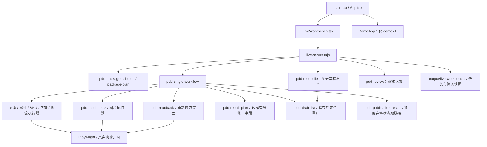

# 源码级交付报告：逐模块阅读版

审阅日期：2026-09-10。依据为当前工作目录源码与本地已保存的真实任务记录。本次只检查源码与证据、编写报告，没有重新操作商家页面，也没有重新运行测试。下文“已有测试”指存在对应测试代码，不等于本次全部重跑通过。

## 1. 先明确已经交付的是什么

当前交付物是 **React + Vite 前端、Node.js 本地服务、Playwright 执行的拼多多单款 T 恤工作台**。已实现导入 JSON、按约定填写真实页面、独立读取结果、有限字段修正、保存草稿、从草稿箱重新打开、历史草稿核查、人工审核记录、读取在售商品链接。

最新真实记录证明：一个虚构测试商品的标题和袖长差异被修正；随后保存草稿并重新打开成功；34 个检查项匹配、0 个差异、3 个素材检查项待核实。**这不是 34 个输入框全部覆盖的声明**：例如 `variants` 一项包含整张 SKU 表，`sizeChart` 一项包含整张尺码表。

尚未交付原始方案中的手机拍照识别、AI 文案、AI 图片/视频、批量上新、多平台和商业化 SaaS。真实执行链里没有接入浏览器 AI Agent，也没有拼多多官方发布 API；目前页面操作由确定性的 Playwright 代码执行。

| 层次 | 当前实现 | 不应误认为 |
|---|---|---|
| 真实入口 | `src/LiveWorkbench.tsx`，默认首页 | 已有完整商品资料编辑器 |
| 演示入口 | `src/App.tsx` 的 `DemoApp`，`?demo=1` | 演示表单直接连接商家后台 |
| 本地真实 API | `scripts/live-server.mjs`，`/api/live/*` | 拼多多官方 API |
| 模拟 API | `scripts/mock-api.mjs`，`openapi/mock-api.yaml` | 真实店铺、真实发布服务 |
| 数据保存 | 本地 JSON、任务目录、浏览器 profile | PostgreSQL、Redis、生产队列 |
| 真实业务范围 | 指定 T 恤页面及已支持字段 | 拼多多全部女装类目 |

## 2. 实际调用关系

建议阅读顺序：先看示例商品包和 Schema，再看编译器、工作流、具体执行器、独立回读，最后看前端与服务。不要从早期模拟页面推断真实功能。

## 3. 模块逐项说明

### 01｜页面入口与真实工作台

源码：[main.tsx](../src/main.tsx)、[App.tsx](../src/App.tsx)、[LiveWorkbench.tsx](../src/LiveWorkbench.tsx)、[live-workbench.css](../src/live-workbench.css)。

- `App()` 根据 `demo=1` 切换；默认渲染 `LiveWorkbench()`。
- `request()` 封装本地 API；页面每两秒轮询状态。
- 输入为商品 JSON、店铺核验配置 JSON、目标编辑页。文件更换后用 `dirty` 阻止使用未重新载入的数据执行。
- 已有按钮：填写、核对、修正标题及属性、保存草稿并重开、重开草稿、读取发布结果。历史任务可以找回草稿核对。
- 输出为步骤进度、期望/实测值、差异、阻断项、人工审核记录和任务 JSON 下载。

**限制：**真实入口不能直接编辑整套商品资料；没有 Excel 导入预览、手机上传、批量列表、暂停/取消。重开产生多个编辑页时仍需要选对页面。错误和阻断原因部分直接展示内部英文字符串。

### 02｜本地 HTTP 服务与任务管理

源码：[live-server.mjs](../scripts/live-server.mjs)，入口 `createLiveServer()`。

| 路由 | 作用 | 主要下游 |
|---|---|---|
| GET `/api/live/state` | 已载入商品、浏览器页面、任务状态 | 内存状态与页面列表 |
| POST `/api/live/package` | 校验、编译并保存输入快照 | `compileProductPackage` |
| POST `/api/live/browser` | 打开或复用专用商家浏览器 | `launchPersistentContext` |
| POST `/api/live/jobs` | 创建单项真实任务 | 工作流或草稿对账 |
| POST `/api/live/reviews` | 保存通过/退回审核记录 | `createReview` |

实现了本机 Host/Origin 检查、JSON 请求限制、4 MB 请求体上限、`busy` 单任务互斥、UUID 任务 ID、异步步骤事件、JSON 临时文件加重命名写入。输入和执行配置会快照化；服务重启后恢复历史记录，将遗留 `running` 标为需检查，不自动重放。

**限制：**互斥只覆盖本服务进程，不能约束另一个 CLI 进程；没有数据库事务、独立 worker、跨进程店铺锁、多用户鉴权、任务租约。`completed` 表示动作结束，并不表示可发布；当前服务状态判定只专门检查 `mismatch/unreadable`，其余限制还需阅读完整报告。

已有测试：[live-server.test.mjs](../scripts/live-server.test.mjs)。服务测试注入模拟浏览器/执行函数，验证接口行为，不是每次连接真实拼多多。

### 03｜启动、停止与开发环境

源码：[start-workbench.mjs](../scripts/start-workbench.mjs)、[workbench-service.mjs](../scripts/workbench-service.mjs)、[vite.config.ts](../vite.config.ts)、[package.json](../package.json)。

`npm run workbench` 启动所缺少的后台和前端服务；`workbench:start/stop/status` 管理后台启动器的 PID 与日志。Vite 使用 5173，真实 API 使用 4318，代理路径为 `/api/live`。浏览器 profile 保存在 `.runtime/pdd-workbench-profile`。

**限制：**这是本机开发启动方案，不是生产部署系统。复用的已有服务和启动器自己创建的子进程有不同生命周期；状态查询也不是完整端到端健康检查。浏览器登录和平台验证码仍需人工完成。

### 04｜统一商品数据契约

源码：[product-package.schema.json](../schemas/product-package.schema.json)、[pdd-package-schema.mjs](../scripts/pdd-package-schema.mjs)。阅读样本：[product-package-tshirt-acceptance-v3.json](../examples/product-package-tshirt-acceptance-v3.json)。

`assertProductPackageSchema()` 使用 Ajv 校验。主要集合：

| 数据 | 保存内容 | 关联方式 |
|---|---|---|
| `product` | 内部 ID、货号、名称、类目、品牌、属性、revision | 一款商品事实 |
| `variants` | 商家 SKU、颜色键/名称、尺码键/名称 | `variant.id` |
| `assets` | 本机路径、角色、顺序、颜色、审核状态 | `asset.id` |
| `sizeCharts` | 成衣或人体建议、列单位、尺码行与数值 | `sizeKey` |
| `listing` | 平台、店铺、标题、报价、价格规则、物流、服务 | `offers.variantId` |
| `evidence` | 字段路径、来源、确认状态、引用 | `fieldPath` |

金额使用整数分，库存使用非负整数；商品与刊登分别有版本。SKU 图片通过 `skuAssetId` 绑定，而不是依赖数组位置。

**限制：**Schema 能表达的范围大于执行器支持范围。例如 Schema 有人体建议、区间尺寸、多尺码制，但当前执行器不支持这些全部类型。`vision/label_ocr` 是来源枚举，不代表 OCR 已实现；`confirmed` 是输入声明，不是系统已核实实物。

已有测试：[pdd-package-schema.test.mjs](../scripts/pdd-package-schema.test.mjs)。

### 05｜商品包编译器与步骤编排

源码：[pdd-package-plan.mjs](../scripts/pdd-package-plan.mjs)，核心 `compileProductPackage()`、`orderProductSteps()`。

输入为商品包及 `shopBindings/freightProfiles`。编译时克隆输入、校验 ID 唯一性和 SKU/素材关联，生成各模块专用输入，计算 `sourceHash` 与含外部绑定的 `executionHash`，递归冻结结果。未知属性会列入覆盖报告。

当前完整配置下有 16 个步骤，实际按输入省略可选模块：

| 顺序 | step ID | 实现 |
|---|---|---|
| 1 | basic | 标题、货号 |
| 2 | carousel | 主图 |
| 3 | matrixAndSku | 颜色尺码矩阵与 SKU 值 |
| 4 | pricing | 参考价、满件折扣 |
| 5–6 | size / sizeSync | 尺码表与同步开关 |
| 7–8 | skuImages / detail | SKU 图与详情图 |
| 9–13 | brand / elements / style / fabric / attributes | 品牌与服装属性 |
| 14–16 | shipping / services / freight | 发货、服务核对、运费 |

素材安排在权威属性填写前，是为减少平台上传素材后联动识别对属性的覆盖。首次真实运行发生过四项属性差异；这一排序调整已经进入源码。

**限制：**当前编译器限定 `womenswear.tshirt + pdd`。`executable:false`、`fullProductVerified:false` 是保留的总体标记；真实工作流仍可执行受支持步骤，因此它不是统一的执行许可状态机。执行指纹目前不包含引擎代码版本。

已有测试：[pdd-package.test.mjs](../scripts/pdd-package.test.mjs)。

### 06｜页面定位与底层读取

源码：[tshirt-v1.json](../config/pdd/tshirt-v1.json)、[pdd-locator-contract.mjs](../scripts/pdd-locator-contract.mjs)、[pdd-observe.mjs](../scripts/pdd-observe.mjs)、[pdd-regions.mjs](../scripts/pdd-regions.mjs)、[pdd-select-option.mjs](../scripts/pdd-select-option.mjs)。

通过可见 label、role、表单区域 ID、表头和颜色/尺码键定位，检查目标唯一性；`indexSkuRows()` 处理颜色单元格的 rowspan。下拉框由确定性选项选择逻辑操作，不调用大模型。

**限制：**依然依赖拼多多 DOM、文案及组件结构，不具备任意页面变化后的自动适配能力。找不到或找到多个目标时会停止；这比盲填可靠，但仍需要维护适配代码。

### 07｜店铺身份与编辑作用域

源码：[pdd-shop-identity.mjs](../scripts/pdd-shop-identity.mjs)、[pdd-draft-write-scope.mjs](../scripts/pdd-draft-write-scope.mjs)、[pdd-basic-adapter.mjs](../scripts/pdd-basic-adapter.mjs)。

`observeShopIdentity()` 从真实页面店铺入口与店铺网页核查名称、mall ID；`assertShopBinding()` 对照配置。`assertReadbackScope/assertBasicScope` 校验编辑页和类目。

`withVerifiedNewDraft()` 处理 `type=edit` 的测试草稿修正/保存：先从草稿箱证明它是“编辑中”、编辑类型为“发布”的新商品草稿，且 goods ID/draft ID 相同，再用 AsyncLocalStorage 将写权限限定在同一页面、同一 URL、当前回调内。列表里的“发布”是编辑类型，不是“已发布”。

**限制：**身份读取涉及悬浮层、二维码和弹出页，曾遇到前台焦点/点击遮挡问题；代码已增加前台切换。没有解决平台验证码，也没有对其他操作者建立远端锁。

### 08｜标题与货号

源码：[pdd-basic-adapter.mjs](../scripts/pdd-basic-adapter.mjs)，核心 `compileBasicPlan()`、`executeBasicPlan()`。

校验非空及当前标题长度限制，查找唯一输入框，填写并触发失焦，然后读取值核对。首次空货号可填，已有货号必须与商品输入一致。

**限制：**没有 AI 标题生成；标题由输入提供。局部修正不会更改货号，避免将一个商品当作另一商品继续操作。

### 09｜品牌与独立服装属性

源码：[pdd-attributes.mjs](../scripts/pdd-attributes.mjs)，核心 `compileAttributePlan()`、`resolveAttributeDom()`、`executeAttributes()`。

当前映射包括品牌、领型、袖长、加绒、克重、纱支、版型、衣长、袖型、适用年龄、上市时节。按约定字段查找下拉选项，填写后逐项及最终回读。

**限制：**不是平台全部必填属性引擎；品牌资质没有自动处理，也不会把未知品牌自动当成无品牌。未知键不自动猜测。

### 10｜联动属性：面料、风格、流行元素

源码：[pdd-fabric.mjs](../scripts/pdd-fabric.mjs)、[pdd-style.mjs](../scripts/pdd-style.mjs)、[pdd-elements.mjs](../scripts/pdd-elements.mjs)。

- `executeFabric()` 处理面料名称、主要材质、成分含量的联动，兼顾只读的成分显示。
- `executeStyle()` 按主风格、子风格顺序选择。
- `executeElements()` 处理多选元素集合；回读用集合排序比较，避免把多个值当成单个字符串。

**限制：**全部消费已确认的结构化输入，不从照片猜成分。现有局部修正器未覆盖这三个联动模块，不能把“初次能填”理解成“失败后均可自动修”。

### 11｜颜色尺码矩阵与 SKU

源码：[pdd-matrix-adapter.mjs](../scripts/pdd-matrix-adapter.mjs)、[pdd-matrix-dom.mjs](../scripts/pdd-matrix-dom.mjs)、[pdd-sku-adapter.mjs](../scripts/pdd-sku-adapter.mjs)、[pdd-sku-dom.mjs](../scripts/pdd-sku-dom.mjs)。

`compileMatrixPlan()` 生成颜色/尺码集合；`prepareSkuMatrix()` 准备矩阵并调用 SKU 执行器。SKU 行按颜色和尺码复合键定位，填写拼单价、单买价、库存、规格编码和启用状态。`parseMoney()/moneyText()` 在整数分与页面金额之间转换。

**限制：**只支持当前中国码路径和完整颜色×尺码组合；稀疏组合抛出 `SPARSE_MATRIX_UNSUPPORTED`。已有数据的矩阵变更会受限制，避免误删已有 SKU/尺码内容。价格库存未纳入差异局部修正。

### 12｜参考价与满件折扣

源码：[pdd-pricing.mjs](../scripts/pdd-pricing.mjs)，核心 `compilePricingPlan()`、`resolvePricingDom()`、`executePricing()`。

校验参考价高于单买价，支持当前满 2 件折扣路径和 5.0～9.9 折范围。草稿保存后变成只读摘要的折扣可以读取核对。

**限制：**不是任意促销规则引擎；能读保存后的摘要，不代表能自动重新编辑所有摘要形态。

### 13｜尺码表与详情同步

源码：[pdd-size-adapter.mjs](../scripts/pdd-size-adapter.mjs)、[pdd-size-dom.mjs](../scripts/pdd-size-dom.mjs)、[pdd-size-sync.mjs](../scripts/pdd-size-sync.mjs)。

`compileSizePlan()/executeSizePlan()` 填写成衣实测的肩宽、胸围，单位 cm，按尺码定位行，数值支持一位小数。`executeSizeSync()` 处理尺码表同步详情开关。

**限制：**尚无衣长等更多测量列、身高体重建议、区间值、其他尺码制。不能因为截图出现“AI 尺码推荐”就说项目接入了该能力。

### 14｜图片预处理与主图上传

源码：[pdd-image-plan.mjs](../scripts/pdd-image-plan.mjs)、[pdd-image-dom.mjs](../scripts/pdd-image-dom.mjs)、[pdd-image-adapter.mjs](../scripts/pdd-image-adapter.mjs)。

校验本机文件，准备字节快照、尺寸和摘要；按顺序上传，等待页面图片就绪，记录远端引用。主图使用当前最多 10 张的约束。

**限制：**主路径要求空素材区；没有抠图、美化、AI 模特或商品图生成。读取到图片已加载，只能证明上传结构，不能证明颜色、衣服细节与实物一致。

### 15｜SKU 图与详情图

源码：[pdd-sku-image-adapter.mjs](../scripts/pdd-sku-image-adapter.mjs)、[pdd-detail-adapter.mjs](../scripts/pdd-detail-adapter.mjs)、[pdd-detail-dom.mjs](../scripts/pdd-detail-dom.mjs)、[pdd-detail-remove.mjs](../scripts/pdd-detail-remove.mjs)。

SKU 图通过颜色/尺码绑定到目标行；详情图通过独立详情区域上传与核对，当前详情图上限 50。另有针对已确认单张错误详情图的精确删除辅助逻辑。

**限制：**没有通用已有素材清理/替换/补齐流程；删除辅助文件不等于工作台已经提供素材编辑器。详情页排版、卖点海报、尺寸图生成也没有实现。

### 16｜素材任务日志与回执绑定

源码：[pdd-media-task.mjs](../scripts/pdd-media-task.mjs)、[pdd-media-bindings.mjs](../scripts/pdd-media-bindings.mjs)、[pdd-media-readback.mjs](../scripts/pdd-media-readback.mjs)、[pdd-media-journal-read.mjs](../scripts/pdd-media-journal-read.mjs)。

`executePackageMedia()` 将上传意图、文件摘要、目标位置、远端引用绑定到商品、店铺、编辑页及输入指纹。独占任务目录避免不明结果时直接重复上传；回读校验数量、目标、加载状态与回执。

同一草稿重开后，平台可能改写图片 URL。代码可以识别同一 goods ID/draft ID，将这种情况标为 `references_changed`，继续要求视觉确认，而非直接视为丢图重传。

**限制：**`contentVerified` 仍为 false。回执与结构核对不是图像内容验证，也没有完整的断点续传/复用调度。

### 17｜发货、服务与运费

源码：[pdd-shipping-adapter.mjs](../scripts/pdd-shipping-adapter.mjs)、[pdd-shipping-dom.mjs](../scripts/pdd-shipping-dom.mjs)、[pdd-services.mjs](../scripts/pdd-services.mjs)、[pdd-freight-profile.mjs](../scripts/pdd-freight-profile.mjs)、[pdd-freight.mjs](../scripts/pdd-freight.mjs)。

发货支持当前 24/48 小时发货及揽收路径。服务模块主要核对普通商品、非二手、非定制、非预售、成团人数、退货、同城服务、正品承诺、付款减库存等已有状态。

运费配置通过店铺与配置版本绑定；选择模板后核对完整包邮、付费、不配送分组。保存后界面“其他模板”变成“默认模板”，会按实际模板名称与区域规则比较，并另保留显示方式变化。

**限制：**没有任意物流模板创建、全部服务承诺自动修改；输入 Schema 的其他发货值也不意味着已支持执行。

### 18｜统一真实工作流与任务日志

源码：[pdd-single-workflow.mjs](../scripts/pdd-single-workflow.mjs)，核心 `runSingleWorkflow()`、`runSingleJournal()`、`saveAndReopenDraft()`。

工作流重新编译输入、绑定页面/店铺，分发确定性执行器；每步记录结果，最后调用独立回读。日志按作用域哈希创建独占目录，意图和结果使用独占写入；失败保留部分结果，不自动重复提交。

动作集合为 `fill/inspect/repair/save-draft/reopen-draft/publication-result`，历史恢复由服务另行分发。**没有自动发布动作。**

**限制：**这是单款工作流，不是批量队列。相同作用域已存在日志时会拒绝重跑，因此日志防重不等于已有完整恢复；例如后续合法再次保存也需要更细的尝试/状态管理。

### 19｜独立回读与覆盖报告

源码：[pdd-readback.mjs](../scripts/pdd-readback.mjs)、[pdd-page-coverage.mjs](../scripts/pdd-page-coverage.mjs)、[pdd-readback-blockers.mjs](../scripts/pdd-readback-blockers.mjs)。

`readbackProductPackage()` 根据原始输入重新编译期望值，再从 DOM 重新读取，避免直接拿执行器“已成功”的结果充当核验。报告包含 expected、observed、状态、店铺身份、页面覆盖和阻断项。

| 状态 | 含义 |
|---|---|
| matched | 该检查项读到的值与期望相同 |
| mismatch | 读到了不同值 |
| unreadable | 该检查项读取失败 |
| uncovered | 当前检查路径没有覆盖 |
| unverified | 结构可检查，但仍欠内容等证据 |

**限制：**当前检查集合由已编译步骤构建；`uncovered=0` 不等于平台全页面无遗漏。包装图、视频、资质和条件必填项仍未全面核验。

阻断项也有历史技术债：编译器保留 `independent_whole_form_readback_unimplemented` 等固定字符串，而部分独立回读实际已实现。因此“仍待完成”混合了实际缺口、待人工确认和未细分的历史总体标记；不能把这些字符串逐条等同于整模块没开发。界面与状态模型需要统一。

### 20｜有限差异修正

源码：[pdd-repair-plan.mjs](../scripts/pdd-repair-plan.mjs)、工作流 `repair` 分支、[pdd-draft-write-scope.mjs](../scripts/pdd-draft-write-scope.mjs)。

`compileRepairSteps()` 校验报告与当前输入指纹、检查项唯一性；只挑出标题、品牌、独立属性中的 mismatch。拒绝修改货号，不将待核实图片转成上传命令。修正前记录完整回读，修正后再完整回读。

输出含 `changedFields` 与 `manualChecks`。最新真实测试种入标题、袖长两项差异，修正后两项恢复。

**限制：**不修矩阵、库存、价格、尺码、联动属性、物流或图片；也不是 AI 自主理解错误并补救。

### 21｜草稿保存、列表定位与恢复核查

源码：[pdd-draft-list.mjs](../scripts/pdd-draft-list.mjs)、[pdd-reconcile.mjs](../scripts/pdd-reconcile.mjs)、工作流 `saveAndReopenDraft()`。

保存前核对；保存按钮只点击一次；观察本次成功提示，再去实际草稿列表按商品 ID 找唯一行、打开编辑页、验证草稿 ID/商品 ID/店铺并重新读取。失败能区分“保存未知”与“已保存但重开失败”。

`recoveryReference()/reconcileDraft()` 用历史任务和输入指纹找回草稿，即使原编辑页关闭也可核对。

**限制：**找到了草稿，不证明中断前最后一次修改已保存；恢复核查是只读对账，不是自动续跑。验证码或页面遮挡仍可能需要人工接管。

### 22｜人工审核与在售链接

源码：[pdd-review.mjs](../scripts/pdd-review.mjs)、[pdd-publication-result.mjs](../scripts/pdd-publication-result.mjs)。

`createReview()` 记录通过/退回、四组确认项、备注、输入/执行/报告指纹和时间；后续写任务使旧报告不能直接继续审核。审核通过不清除系统阻断，也不授权自动发布。

`collectPublicationResult()` 读取真实商品列表，要求销售中状态与相应操作证据，再从页面提供的链接入口取 URL，并校验 goods ID。返回 `published:true` 表示观察到在售，不表示程序执行过发布。

**限制：**审核人是本地 `local_operator`，没有多用户权限体系。发布处理中、审核驳回等细分状态尚不完整；新商品人工发布后的完整闭环尚未验收。

### 23｜命令行工具与诊断脚本

入口：[pdd-single.mjs](../scripts/pdd-single.mjs)。独立 `pdd-fill-*`、`pdd-upload-*` 包装各执行器，用于限定模块试验；`pdd-check-package` 做回读，`pdd-compile-package` 生成计划，`pdd-run-media` 与 `pdd-inspect-media-task` 执行/检查素材任务。

[pdd-inspect.mjs](../scripts/pdd-inspect.mjs)、[analyze-pdd-capture.mjs](../scripts/analyze-pdd-capture.mjs)、[pdd-verify-locators.mjs](../scripts/pdd-verify-locators.mjs) 用于采集、分析真实页面与验证定位约定。

**限制：**单款 CLI 菜单未同步提供全部网页动作；不同入口可能使用不同 profile 和日志目录。工具文件数量不能当成独立产品功能数量。

### 24｜早期模拟系统与测试基础

源码：[domain.ts](../src/domain.ts)、[mock-draft.ts](../src/mock-draft.ts)、[App.tsx](../src/App.tsx)、[mock-api.mjs](../scripts/mock-api.mjs)、[mock-playwright.mjs](../scripts/mock-playwright.mjs)、[mock-api.yaml](../openapi/mock-api.yaml)。

`domain.ts` 提供演示商品类型、样例、校验与库存汇总。`MockDraft` 分离期望值和模拟实际值；模拟 API 使用内存 Map 管理刊登、任务与审核，便于验证前后端流程。演示页使用 localStorage。

**限制：**模拟类型不是实际商品包的同一套类型，模拟 API 没有连接拼多多。模拟页里的编辑能力、SKU 示例和任务状态不能算作真实工作台交付。

## 4. 真实验收证据与结论边界

最新证据保存在本机忽略目录 `output/acceptance/2026-09-10/repair-and-save.json`，不随开源仓库发布。公开文档已移除测试货号、商品 ID 和草稿 ID。

| 环节 | 已记录事实 | 不能据此推断 |
|---|---|---|
| 初次全量填写 | 有真实网页填写记录；首次发生属性差异，后调整执行顺序 | 所有商品均无联动差异 |
| 局部修正 | 任务 `7cbe17b6-a7a3-41b2-b6cf-a87d0af22440`，标题/袖长两项修正成功 | 全字段自动恢复 |
| 保存并重开 | 任务 `e077acea-f8fb-4052-b3b7-2a0730935e98`，saved=true、reopened=true | 已发布或完整商品已验收 |
| 重开后回读 | matched=34、mismatch=0、unreadable=0、uncovered=0、unverified=3 | 平台所有必填项覆盖 |
| 素材 | 主图/SKU 图/详情图结构与引用检查存在 | 内容与真实衣服相符 |
| 发布 | `publicationExecuted=false` | 创建了一个新的可售链接 |

早期 [49 章](49-completion-audit.md) 的开头描述落后于后续追加证据；遇到冲突，以具体任务结果和当前源码为依据。测试商品是虚构验收资料，不是销售资料。

自动化测试主要验证编译约束、DOM 样例、金额处理、错误停止、日志、防重、API 和恢复条件；真实任务记录验证特定店铺、页面和输入组合。两类证据必须分开阅读。

## 5. 尚未完成与源码对应的原因

| 缺口 | 源码表现 | 性质 |
|---|---|---|
| 自动选择类目与全类目规则 | 当前要求人工进入 T 恤编辑页，编译器限定类目 | 业务覆盖待扩展 |
| 真实资料编辑/手机/Excel | LiveWorkbench 仅 JSON 文件导入 | 产品输入链未完成 |
| 稀疏 SKU、多尺寸列 | 编译/执行器明确拒绝不支持形态 | 有界能力待扩展 |
| 素材内容确认与已有图续写 | `contentVerified:false`，上传强调空区域 | 业务验收及恢复缺口 |
| 完整字段/资质覆盖 | 固定阻断项和部分页面区域未覆盖 | 平台规则待落实 |
| 任意失败续跑 | 只修有限属性，独占日志拒绝原样重跑 | 状态/恢复设计待完善 |
| 发布状态闭环 | 有在售查询，无完整新商品发布后验收 | 集成验收待完成 |
| 3/10/50/100 款批量 | 单进程 `busy`，无批量输入与队列 | 功能未实现 |
| AI 识别/文案/图/视频 | 无对应真实模型调用链 | 功能未实现 |
| 多平台/官方 API | 无其他真实 Adapter/官方发布接入 | 功能未实现 |
| 商业化部署 | 文件存储、本地单用户/浏览器 | 基础设施未实现 |

此前推进慢的源码层原因可以具体落到三点：模拟层与真实层分离造成两套模型；独立脚本先做、统一工作台和恢复后补，产生较多入口与生命周期适配；整体阻断标记没有随细分能力同步收敛，使界面不能准确表达“已实现但未全验收”。这些都不应归因于用户没有验证接口。当前浏览器 MVP 并不以官方 API 授权为前置条件。

## 6. 逐文件阅读索引

下方附录由本次目录扫描生成，列出 `src/`、`scripts/`、`schemas/`、`config/`、`openapi/` 中的全部文件及可直接检索的导出符号。测试文件单列；符号清单用于定位，不代表每个导出都是一个独立业务功能。

### A. 运行代码、配置及夹具

| 文件 | 导出符号 / 阅读提示 |
|---|---|
| [config/pdd/tshirt-v1.json](../config/pdd/tshirt-v1.json) | 配置 / 数据契约 / 夹具 |
| [openapi/mock-api.yaml](../openapi/mock-api.yaml) | 配置 / 数据契约 / 夹具 |
| [schemas/product-package.schema.json](../schemas/product-package.schema.json) | 配置 / 数据契约 / 夹具 |
| [scripts/analyze-pdd-capture.mjs](../scripts/analyze-pdd-capture.mjs) | 入口或命令行包装；沿 import 阅读下游 |
| [scripts/fixtures/pdd-sku-structure.json](../scripts/fixtures/pdd-sku-structure.json) | 配置 / 数据契约 / 夹具 |
| [scripts/live-server.mjs](../scripts/live-server.mjs) | `createLiveServer` |
| [scripts/mock-api.mjs](../scripts/mock-api.mjs) | `createMockApi`、`listenMockApi` |
| [scripts/mock-playwright.mjs](../scripts/mock-playwright.mjs) | 入口或命令行包装；沿 import 阅读下游 |
| [scripts/pdd-attributes.mjs](../scripts/pdd-attributes.mjs) | `supportedAttributeKeys`、`compileAttributePlan`、`resolveAttributeDom`、`executeAttributes` |
| [scripts/pdd-basic-adapter.mjs](../scripts/pdd-basic-adapter.mjs) | `compileBasicPlan`、`assertReadbackScope`、`assertBasicScope`、`executeBasicPlan` |
| [scripts/pdd-check-package.mjs](../scripts/pdd-check-package.mjs) | 入口或命令行包装；沿 import 阅读下游 |
| [scripts/pdd-check-services.mjs](../scripts/pdd-check-services.mjs) | 入口或命令行包装；沿 import 阅读下游 |
| [scripts/pdd-compile-package.mjs](../scripts/pdd-compile-package.mjs) | 入口或命令行包装；沿 import 阅读下游 |
| [scripts/pdd-detail-adapter.mjs](../scripts/pdd-detail-adapter.mjs) | `compileDetailPlan`、`executeDetailImages`、`uploadPreparedDetail` |
| [scripts/pdd-detail-dom.mjs](../scripts/pdd-detail-dom.mjs) | `observeDetail` |
| [scripts/pdd-detail-remove.mjs](../scripts/pdd-detail-remove.mjs) | `compileDetailRemoval`、`resolveDetailRemoveTarget`、`executeDetailRemoval` |
| [scripts/pdd-draft-list.mjs](../scripts/pdd-draft-list.mjs) | `editorIdentity`、`readDraftRow`、`reopenFromDraftList` |
| [scripts/pdd-draft-write-scope.mjs](../scripts/pdd-draft-write-scope.mjs) | `hasVerifiedDraftScope`、`withVerifiedNewDraft` |
| [scripts/pdd-elements.mjs](../scripts/pdd-elements.mjs) | `compileElementsPlan`、`resolveElementsDom`、`executeElements` |
| [scripts/pdd-fabric.mjs](../scripts/pdd-fabric.mjs) | `compileFabricPlan`、`executeFabric` |
| [scripts/pdd-fill-attributes.mjs](../scripts/pdd-fill-attributes.mjs) | 入口或命令行包装；沿 import 阅读下游 |
| [scripts/pdd-fill-basic.mjs](../scripts/pdd-fill-basic.mjs) | 入口或命令行包装；沿 import 阅读下游 |
| [scripts/pdd-fill-elements.mjs](../scripts/pdd-fill-elements.mjs) | 入口或命令行包装；沿 import 阅读下游 |
| [scripts/pdd-fill-fabric.mjs](../scripts/pdd-fill-fabric.mjs) | 入口或命令行包装；沿 import 阅读下游 |
| [scripts/pdd-fill-freight.mjs](../scripts/pdd-fill-freight.mjs) | 入口或命令行包装；沿 import 阅读下游 |
| [scripts/pdd-fill-pricing.mjs](../scripts/pdd-fill-pricing.mjs) | 入口或命令行包装；沿 import 阅读下游 |
| [scripts/pdd-fill-shipping.mjs](../scripts/pdd-fill-shipping.mjs) | 入口或命令行包装；沿 import 阅读下游 |
| [scripts/pdd-fill-size-sync.mjs](../scripts/pdd-fill-size-sync.mjs) | 入口或命令行包装；沿 import 阅读下游 |
| [scripts/pdd-fill-size.mjs](../scripts/pdd-fill-size.mjs) | 入口或命令行包装；沿 import 阅读下游 |
| [scripts/pdd-fill-sku.mjs](../scripts/pdd-fill-sku.mjs) | 入口或命令行包装；沿 import 阅读下游 |
| [scripts/pdd-fill-style.mjs](../scripts/pdd-fill-style.mjs) | 入口或命令行包装；沿 import 阅读下游 |
| [scripts/pdd-freight-profile.mjs](../scripts/pdd-freight-profile.mjs) | `resolveFreightProfile` |
| [scripts/pdd-freight.mjs](../scripts/pdd-freight.mjs) | `compileFreightPlan`、`observeFreight`、`executeFreight`、`freightBusinessValues` |
| [scripts/pdd-image-adapter.mjs](../scripts/pdd-image-adapter.mjs) | `preflightCarousel`、`uploadPreparedCarousel`、`executeCarousel` |
| [scripts/pdd-image-dom.mjs](../scripts/pdd-image-dom.mjs) | `observeCarousel` |
| [scripts/pdd-image-plan.mjs](../scripts/pdd-image-plan.mjs) | `carouselPolicy`、`compileImagePlan`、`decodeImageBytes`、`validateImageDimensions`、`loadImageFiles`、`prepareImageFiles`、`imageManifest` |
| [scripts/pdd-inspect-media-task.mjs](../scripts/pdd-inspect-media-task.mjs) | 入口或命令行包装；沿 import 阅读下游 |
| [scripts/pdd-inspect.mjs](../scripts/pdd-inspect.mjs) | 入口或命令行包装；沿 import 阅读下游 |
| [scripts/pdd-locator-contract.mjs](../scripts/pdd-locator-contract.mjs) | `assertPddEditorUrl`、`assertActionAllowed`、`buildFieldPlan`、`buildVariantRowKey`、`assessLocatorCoverage` |
| [scripts/pdd-matrix-adapter.mjs](../scripts/pdd-matrix-adapter.mjs) | `compileMatrixPlan`、`assessMatrix`、`executeMatrixPlan`、`prepareSkuMatrix` |
| [scripts/pdd-matrix-dom.mjs](../scripts/pdd-matrix-dom.mjs) | `resolveMatrixDom` |
| [scripts/pdd-media-bindings.mjs](../scripts/pdd-media-bindings.mjs) | `verifyMediaBindings` |
| [scripts/pdd-media-journal-read.mjs](../scripts/pdd-media-journal-read.mjs) | `inspectMediaJournal` |
| [scripts/pdd-media-readback.mjs](../scripts/pdd-media-readback.mjs) | `assessMediaReadback` |
| [scripts/pdd-media-task.mjs](../scripts/pdd-media-task.mjs) | `createMediaReceipt`、`runMediaJournal`、`executePackageMedia` |
| [scripts/pdd-observe.mjs](../scripts/pdd-observe.mjs) | `observePddFields` |
| [scripts/pdd-package-plan.mjs](../scripts/pdd-package-plan.mjs) | `orderProductSteps`、`compileProductPackage` |
| [scripts/pdd-package-schema.mjs](../scripts/pdd-package-schema.mjs) | `assertProductPackageSchema` |
| [scripts/pdd-page-coverage.mjs](../scripts/pdd-page-coverage.mjs) | `observePageCoverage`、`assessPageCoverage` |
| [scripts/pdd-prepare-skus.mjs](../scripts/pdd-prepare-skus.mjs) | 入口或命令行包装；沿 import 阅读下游 |
| [scripts/pdd-pricing.mjs](../scripts/pdd-pricing.mjs) | `compilePricingPlan`、`resolvePricingDom`、`executePricing` |
| [scripts/pdd-publication-result.mjs](../scripts/pdd-publication-result.mjs) | `validateProductLink`、`readOnSaleRow`、`collectPublicationResult` |
| [scripts/pdd-readback-blockers.mjs](../scripts/pdd-readback-blockers.mjs) | `assessReadbackBlockers` |
| [scripts/pdd-readback.mjs](../scripts/pdd-readback.mjs) | `readBasicField`、`readbackProductPackage` |
| [scripts/pdd-reconcile.mjs](../scripts/pdd-reconcile.mjs) | `recoveryReference`、`reconcileDraft` |
| [scripts/pdd-regions.mjs](../scripts/pdd-regions.mjs) | `observePddRegions`、`indexSkuRows` |
| [scripts/pdd-repair-plan.mjs](../scripts/pdd-repair-plan.mjs) | `compileRepairSteps` |
| [scripts/pdd-review.mjs](../scripts/pdd-review.mjs) | `reviewItems`、`createReview` |
| [scripts/pdd-run-media.mjs](../scripts/pdd-run-media.mjs) | 入口或命令行包装；沿 import 阅读下游 |
| [scripts/pdd-select-option.mjs](../scripts/pdd-select-option.mjs) | `findExactVisibleOption` |
| [scripts/pdd-services.mjs](../scripts/pdd-services.mjs) | `compileServicesPlan`、`observeServices`、`verifyServices` |
| [scripts/pdd-shipping-adapter.mjs](../scripts/pdd-shipping-adapter.mjs) | `compileShippingPlan`、`executeShipping` |
| [scripts/pdd-shipping-dom.mjs](../scripts/pdd-shipping-dom.mjs) | `resolveShippingDom` |
| [scripts/pdd-shop-identity.mjs](../scripts/pdd-shop-identity.mjs) | `parseShopHomeUrl`、`readShopHeader`、`resolveShopBinding`、`assertShopBinding`、`isShopQrRendered`、`observeShopIdentity` |
| [scripts/pdd-single-workflow.mjs](../scripts/pdd-single-workflow.mjs) | `runSingleJournal`、`expandServiceSection`、`assertDraftReadback`、`runSingleWorkflow`、`saveAndReopenDraft` |
| [scripts/pdd-single.mjs](../scripts/pdd-single.mjs) | 入口或命令行包装；沿 import 阅读下游 |
| [scripts/pdd-size-adapter.mjs](../scripts/pdd-size-adapter.mjs) | `compileSizePlan`、`sizeDifferences`、`executeSizePlan` |
| [scripts/pdd-size-dom.mjs](../scripts/pdd-size-dom.mjs) | `resolveSizeDom` |
| [scripts/pdd-size-sync.mjs](../scripts/pdd-size-sync.mjs) | `compileSizeSyncPlan`、`resolveSizeSyncDom`、`executeSizeSync` |
| [scripts/pdd-sku-adapter.mjs](../scripts/pdd-sku-adapter.mjs) | `compileSkuPlan`、`moneyText`、`parseMoney`、`skuDifferences`、`executeSkuPlan`、`compileSkuPlanFromPackage` |
| [scripts/pdd-sku-dom.mjs](../scripts/pdd-sku-dom.mjs) | `resolveSkuDom` |
| [scripts/pdd-sku-image-adapter.mjs](../scripts/pdd-sku-image-adapter.mjs) | `compileSkuImagePlan`、`executeSkuImages`、`executePreparedSkuImages` |
| [scripts/pdd-style.mjs](../scripts/pdd-style.mjs) | `compileStylePlan`、`executeStyle` |
| [scripts/pdd-upload-detail-images.mjs](../scripts/pdd-upload-detail-images.mjs) | 入口或命令行包装；沿 import 阅读下游 |
| [scripts/pdd-upload-images.mjs](../scripts/pdd-upload-images.mjs) | 入口或命令行包装；沿 import 阅读下游 |
| [scripts/pdd-upload-sku-images.mjs](../scripts/pdd-upload-sku-images.mjs) | 入口或命令行包装；沿 import 阅读下游 |
| [scripts/pdd-verify-locators.mjs](../scripts/pdd-verify-locators.mjs) | 入口或命令行包装；沿 import 阅读下游 |
| [scripts/start-workbench.mjs](../scripts/start-workbench.mjs) | 入口或命令行包装；沿 import 阅读下游 |
| [scripts/workbench-service.mjs](../scripts/workbench-service.mjs) | 入口或命令行包装；沿 import 阅读下游 |
| [src/App.tsx](../src/App.tsx) | `App` |
| [src/LiveWorkbench.tsx](../src/LiveWorkbench.tsx) | `LiveWorkbench` |
| [src/domain.ts](../src/domain.ts) | `Variant`、`Asset`、`Product`、`Issue`、`JobState`、`initialProduct`、`validateProduct`、`totalStock`、`parseNumericInput`、`validMoney` |
| [src/linkage.css](../src/linkage.css) | 页面样式 |
| [src/live-workbench.css](../src/live-workbench.css) | 页面样式 |
| [src/main.tsx](../src/main.tsx) | 入口或命令行包装；沿 import 阅读下游 |
| [src/mock-draft.ts](../src/mock-draft.ts) | `MockDraft`、`differences` |
| [src/styles.css](../src/styles.css) | 页面样式 |
| [src/vite-env.d.ts](../src/vite-env.d.ts) | 类型环境声明 |

### B. 测试源码

测试名相近的文件通常对应上文同名模块；是否连接真实页面应查看测试内的夹具和依赖注入。

- [scripts/live-server.test.mjs](../scripts/live-server.test.mjs)
- [scripts/mock-api.test.mjs](../scripts/mock-api.test.mjs)
- [scripts/pdd-attributes.test.mjs](../scripts/pdd-attributes.test.mjs)
- [scripts/pdd-detail-remove.test.mjs](../scripts/pdd-detail-remove.test.mjs)
- [scripts/pdd-detail.test.mjs](../scripts/pdd-detail.test.mjs)
- [scripts/pdd-elements.test.mjs](../scripts/pdd-elements.test.mjs)
- [scripts/pdd-execution.test.mjs](../scripts/pdd-execution.test.mjs)
- [scripts/pdd-fabric.test.mjs](../scripts/pdd-fabric.test.mjs)
- [scripts/pdd-freight.test.mjs](../scripts/pdd-freight.test.mjs)
- [scripts/pdd-image.test.mjs](../scripts/pdd-image.test.mjs)
- [scripts/pdd-list-recovery.test.mjs](../scripts/pdd-list-recovery.test.mjs)
- [scripts/pdd-locator-contract.test.mjs](../scripts/pdd-locator-contract.test.mjs)
- [scripts/pdd-matrix.test.mjs](../scripts/pdd-matrix.test.mjs)
- [scripts/pdd-media-bindings.test.mjs](../scripts/pdd-media-bindings.test.mjs)
- [scripts/pdd-media-readback.test.mjs](../scripts/pdd-media-readback.test.mjs)
- [scripts/pdd-media-task.test.mjs](../scripts/pdd-media-task.test.mjs)
- [scripts/pdd-observe.test.mjs](../scripts/pdd-observe.test.mjs)
- [scripts/pdd-package-schema.test.mjs](../scripts/pdd-package-schema.test.mjs)
- [scripts/pdd-package.test.mjs](../scripts/pdd-package.test.mjs)
- [scripts/pdd-page-coverage.test.mjs](../scripts/pdd-page-coverage.test.mjs)
- [scripts/pdd-pricing.test.mjs](../scripts/pdd-pricing.test.mjs)
- [scripts/pdd-readback-blockers.test.mjs](../scripts/pdd-readback-blockers.test.mjs)
- [scripts/pdd-readback.test.mjs](../scripts/pdd-readback.test.mjs)
- [scripts/pdd-reconcile.test.mjs](../scripts/pdd-reconcile.test.mjs)
- [scripts/pdd-repair.test.mjs](../scripts/pdd-repair.test.mjs)
- [scripts/pdd-review.test.mjs](../scripts/pdd-review.test.mjs)
- [scripts/pdd-select-option.test.mjs](../scripts/pdd-select-option.test.mjs)
- [scripts/pdd-services.test.mjs](../scripts/pdd-services.test.mjs)
- [scripts/pdd-shipping.test.mjs](../scripts/pdd-shipping.test.mjs)
- [scripts/pdd-shop-identity.test.mjs](../scripts/pdd-shop-identity.test.mjs)
- [scripts/pdd-single-workflow.test.mjs](../scripts/pdd-single-workflow.test.mjs)
- [scripts/pdd-size-sync.test.mjs](../scripts/pdd-size-sync.test.mjs)
- [scripts/pdd-size.test.mjs](../scripts/pdd-size.test.mjs)
- [scripts/pdd-sku-image.test.mjs](../scripts/pdd-sku-image.test.mjs)
- [scripts/pdd-sku.test.mjs](../scripts/pdd-sku.test.mjs)
- [scripts/pdd-style.test.mjs](../scripts/pdd-style.test.mjs)
- [src/domain.test.ts](../src/domain.test.ts)
- [src/mock-draft.test.ts](../src/mock-draft.test.ts)

本次没有重新运行这些测试。验证当前版本可使用 `npm test`、`node --test scripts/*.test.mjs` 和 `npm run build`；这些命令的结果仍不替代真实商家验收。
